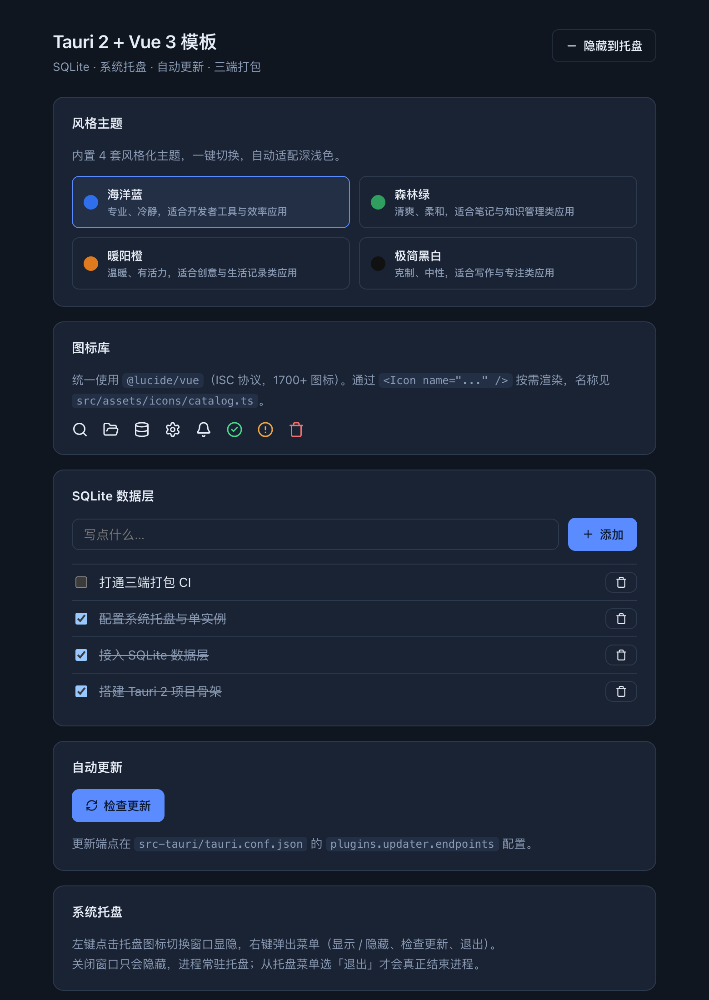
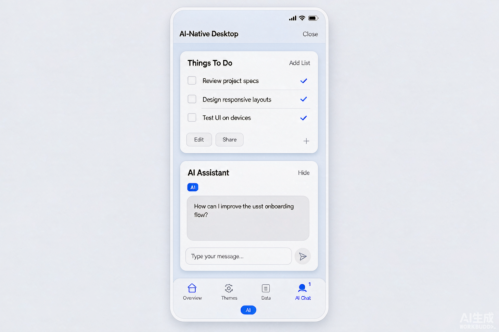
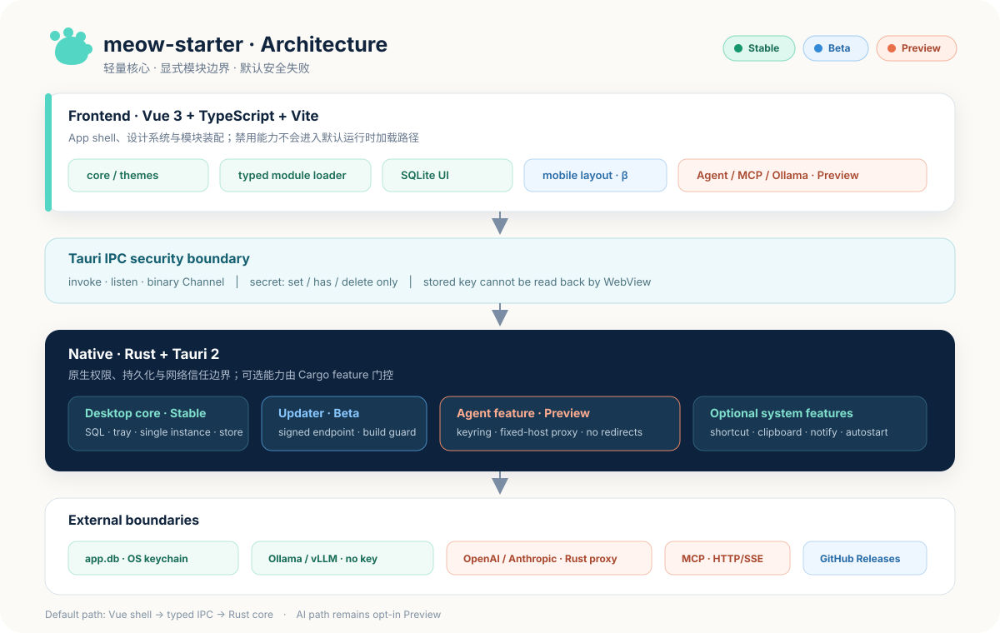

<p align="center">
  <strong>中文</strong> · <a href="./README.en.md">English</a>
</p>

<p align="center">
  
</p>

<h1 align="center">meow-starter</h1>

<p align="center">
  <strong>AI Native、桌面优先、Web 可用的跨平台应用脚手架</strong><br/>
  一套可直接扩展的 <b>Tauri 2 + Vue 3</b> 底座：桌面三端为主，Web 与移动端提供 Beta 级适配。<br/>
  稳定核心包含本地数据、托盘与设计系统；同步、更新器及 Agent / MCP / 本地推理按成熟度渐进启用。
</p>

<p align="center">
  <a href="https://github.com/Shiaoming123/meow-starter/actions/workflows/ci.yml"></a>
  <a href="https://github.com/Shiaoming123/meow-starter/releases"></a>
  <a href="./LICENSE"></a>
  
  
  
  
</p>

<p align="center">
  
  &nbsp;&nbsp;&nbsp;
  
</p>

---

## 这是什么

`meow-starter` 是一个**模块化、AI Native** 的全平台应用脚手架。它把跨端开发里最烦的样板代码全部做完——数据层、托盘、更新、设计系统——同时把 AI 能力（Agent、本地推理、MCP）做成**可插拔模块**，让你按需启用。

**核心理念**：核心轻量、能力可选、按需引入。不写一行 Agent 代码，它就是干净的桌面脚手架；打开一个开关，它就变成 AI 应用。

### Web + 五端覆盖

| 平台 | 状态 | 说明 |
| --- | --- | --- |
| Web | Beta | Vite 静态构建 + IndexedDB 持久化；原生模块按能力自动跳过 |
| macOS | Stable | release workflow 覆盖构建、签名与公证配置 |
| Windows | Stable | release workflow 覆盖 MSVC + WebView2 打包 |
| Linux | Stable | release workflow 覆盖 Ubuntu 构建；其他发行版需项目自行验证 |
| iOS | Beta | 响应式与桌面能力降级已落地；尚未在 Xcode/真机持续验证 |
| Android | Beta | 响应式与桌面能力降级已落地；尚未在 Android 工具链/真机持续验证 |

> 移动端当前表示“代码适配可用”，不是“已验证可发布”。原生工程初始化需要 Android Studio + NDK / Xcode + CocoaPods，详见 [docs/mobile.md](./docs/mobile.md)。

## ✨ 特性

- **前端**：Vue 3.5 + TypeScript + Vite 6，深色模式跟随系统
- **数据层**：统一领域接口；Tauri 使用 SQLite，Web 使用 IndexedDB
- **系统层**：系统托盘、单实例、关闭窗口隐藏而非退出
- **自动更新（Beta）**：包含签名、下载、安装与重启代码路径；需用自己的端点和密钥完成签名发布验证
- **设计系统**：完整 design tokens + 6 个基础组件 + 4 套风格主题
- **模块化**：四层门控（配置 + 动态 import + 运行时能力 + 原生 Cargo feature），能力可插拔
- **同步底座（Preview）**：默认关闭的 outbox 引擎、白名单策略与 HTTP transport；不绑定云厂商
- **Agent 能力（Preview）**：Vercel AI SDK inline 适配器与扩展接口；默认关闭
- **密钥安全（Preview）**：已存密钥不可从 WebView 读回；OpenAI/Anthropic 请求由固定目标的 Rust 代理注入
- **本地推理（Preview）**：提供 Ollama/OpenAI-compatible 预设，需开发者验证本机环境
- **MCP 接入（Preview）**：提供 HTTP/SSE client 适配器，完整 Agent 工具闭环仍在验证
- **工程化**：GitHub Actions 三端打包 + CI 质量门禁
- **无 Electron**：安装包约 3–20 MB，远小于 Electron 的 ~300 MB

## 🗺 从这里开始（全链路指引）

**第一次来？按这个顺序走：**

| 我想… | 去哪看 |
| --- | --- |
| 🚀 快速跑起来 | [快速开始](#-快速开始) → [改名清单](#-用它创建新项目) |
| 🛠 配置本地开发 / exFAT 工作区 | [docs/development.md](./docs/development.md) |
| 📦 了解 Release Kit 与发布边界 | [docs/release-kit.md](./docs/release-kit.md) |
| 🎯 判断适不适合我的项目 | [docs/project-guide.md](./docs/project-guide.md) |
| 🏗 理解架构 | [架构图](#-架构) + [模块化架构](./docs/modular-architecture.md) |
| 🎨 用设计系统/组件 | [docs/design-system.md](./docs/design-system.md) |
| 🤖 接入 Agent（对话/工具） | [docs/agent-integration.md](./docs/agent-integration.md) |
| 🔌 接本地模型（Ollama） | [docs/local-inference.md](./docs/local-inference.md) |
| 🧩 接 MCP 外部工具 | [docs/mcp.md](./docs/mcp.md) |
| 🌐 运行和部署 Web 版 | [docs/web.md](./docs/web.md) |
| 🔄 接账号、云端或局域网同步 | [docs/sync.md](./docs/sync.md) |
| 📱 移动端适配（Android / iOS） | [docs/mobile.md](./docs/mobile.md) |
| 🧠 了解全部 AI 能力规划 | [docs/ai-capabilities.md](./docs/ai-capabilities.md) |
| 🤝 贡献 / 反馈 | [CONTRIBUTING.md](./CONTRIBUTING.md) · [Discussions](https://github.com/Shiaoming123/meow-starter/discussions) |

**给 AI agent 的提示**：这个项目有清晰的模块边界与文档体系。改功能前先读对应的 docs 文档，能少走很多弯路。

## 🚀 快速开始

```bash
# 方式一：直接克隆
git clone https://github.com/Shiaoming123/meow-starter.git my-app
cd my-app && npm install && npm run tauri dev

# 方式二：用 degit 拉干净副本（不含 git 历史，推荐）
npx degit Shiaoming123/meow-starter my-app
cd my-app && npm install && npm run tauri dev
```

只运行 Web 版：

```bash
npm run dev:web
```

**环境要求**：Node.js 22+ / Rust 1.77.2+ / 平台依赖（macOS 需 Xcode CLT，Windows 需 MSVC + WebView2，Linux 需 webkit2gtk 等，详见 [Tauri 官方文档](https://tauri.app/start/prerequisites/)）。

## 🧩 用它创建新项目（改名清单）

漏掉任何一项会导致构建失败或覆盖别人的 App：

1. `package.json` 的 `name`
2. `src-tauri/Cargo.toml` 的 `name` 与 `[lib] name`（lib 名 = 包名下划线 + `_lib`）
3. `src-tauri/tauri.conf.json` 的 `productName` 与 `identifier`（⚠️ identifier 发布后不可改）
4. 替换 `public/meow-mark.svg`，再运行 `npm run tauri -- icon public/meow-mark.svg -o src-tauri/icons` 生成自己的打包图标
5. 重新生成更新签名密钥（`npm run tauri:signer`）
6. 将 `plugins.updater.endpoints` 中的 `OWNER/REPO` 替换为自己的仓库
7. 更新 `package.json` 与 `src-tauri/Cargo.toml` 的 repository/homepage/author 元数据
8. 修改 `src/App.vue` 的品牌文案、`src-tauri/src/tray.rs` 的 tooltip，以及钥匙串命名空间 `src-tauri/src/agent/secrets.rs`
9. 同步 `package.json`、`src-tauri/Cargo.toml`、`src-tauri/tauri.conf.json` 的版本号

## 🧱 模块化能力一览

每个能力都是一个**可插拔模块**，在 `src/modules/config.ts` 里开关：

| 模块 | 类型 | 默认 | 说明 |
| --- | --- | --- | --- |
| `core` | 核心 | 始终 | 设计系统 + 组件库 + 主题 + 图标 |
| `storage` | 核心 | 始终 | 领域存储契约 + 内存安全回退 |
| `sqlite` | 平台适配 | 开 | Tauri SQLite 数据层；仅原生运行时装配 |
| `indexedDb` | 平台适配 | 开 | Web IndexedDB 持久化；仅浏览器装配 |
| `sync` | 可选 | 关 | 本地优先同步接口、outbox 引擎与 transport |
| `tray` | 核心 | 开 | 系统托盘 |
| `updater` | 核心 | 开 | 自动更新 |
| `themes` | 核心 | 开 | 4 套风格主题 |
| `agent` | 可选 | 关 | Agent 运行时（需 `npm run add:agent`） |
| `mcp` | 可选 | 关 | MCP 接入（需 `npm run add:mcp`） |
| `shortcut` | 可选 | 关 | 全局快捷键（P1） |
| `clipboard` | 可选 | 关 | 剪贴板（P1） |
| `notification` | 可选 | 关 | 系统通知（P1） |
| `autostart` | 可选 | 关 | 开机自启（P1） |

> 完整设计见 [docs/modular-architecture.md](./docs/modular-architecture.md)。关闭的模块不会进入默认运行时加载路径；依赖安装量与最终产物体积仍应以 lockfile 和构建产物为准。

### 成熟度约定

| 级别 | 含义 | 当前能力 |
| --- | --- | --- |
| Stable | 默认路径有自动化门禁 | core、SQLite、主题、桌面托盘/单实例 |
| Beta | 代码闭环存在，但发布环境验证仍有限 | Web IndexedDB、更新器、移动端响应式与能力降级 |
| Preview | 默认关闭，接口与安全边界仍可能变化 | Sync、Agent、Ollama、MCP、可选系统插件 |
| Roadmap | 只有设计或占位，不承诺可运行 | sidecar、RAG、语音、OCR |

## 🏗 架构



前端（Vue 3）通过 `invoke` / `listen` 与 Rust 运行时通信；模块 loader 按依赖顺序装配启用能力。Agent、Ollama、云端模型与 MCP 位于 Preview 扩展层，默认路径不加载。

### Web + 五端覆盖


同一份 Vue 代码面向 **Web / macOS / Windows / Linux / Android / iOS**。桌面三端是主要验证目标；Web 使用 IndexedDB 并跳过原生模块，移动端采用响应式布局并降级桌面专属能力。

## 📂 项目结构

```
.
├── .github/               # CI（ci.yml 门禁 + release.yml 三端打包）
├── docs/                  # 📚 文档中心
│   ├── architecture.svg        # 架构图
│   ├── development.md          # 本地开发、验证与 exFAT 处理
│   ├── release-kit.md          # Release Kit 与发布成熟度边界
│   ├── design-system.md        # 设计系统（token/组件/主题/性能）
│   ├── project-guide.md        # 项目适配指南（适合做什么+分类型注意事项）
│   ├── modular-architecture.md # 模块化架构（四层门控+Module契约）
│   ├── ai-capabilities.md      # AI Native 能力清单（P1-P3 节奏）
│   ├── agent-integration.md    # Agent 集成方案（框架对比+双轨设计）
│   ├── local-inference.md      # 本地推理（Ollama）
│   ├── web.md                  # Web 运行、持久化与部署
│   ├── sync.md                 # 账号、云端与局域网同步
│   └── mcp.md                  # MCP 接入指南
├── src/
│   ├── assets/themes/     # 主题 token + 全局样式
│   ├── components/        # Icon.vue + ui/（Button/Card/Input/Badge/Progress/EmptyState）
│   ├── modules/           # ★ 模块化：config（开关）+ loader（装配）+ 各能力模块
│   ├── agent/             # Agent 能力（runtime/providers/tools/memory/hooks/ui）
│   ├── storage/           # 领域存储接口 + IndexedDB/SQLite/内存适配器
│   ├── sync/              # SyncProvider + outbox + HTTP transport
│   ├── lib/               # db.ts / updater.ts
│   └── App.vue            # 演示页（侧边栏 + 主题 + 数据 + 更新）
├── src-tauri/
│   ├── src/lib.rs         # 应用装配（核心 + feature 门控）
│   ├── src/tray.rs        # 托盘
│   ├── src/db.rs          # SQLite 迁移
│   ├── src/agent/         # 密钥代理（secrets.rs + proxy.rs）
│   ├── capabilities/      # 权限白名单
│   └── tauri.conf.json    # 应用配置
├── agent.config.ts        # Agent 配置（模型/Provider/工具）
├── CONTRIBUTING.md
├── CODE_OF_CONDUCT.md
├── SECURITY.md
├── CHANGELOG.md
└── LICENSE
```

## ⚙️ 核心模块说明

### 本地数据层（SQLite / IndexedDB）

前端统一经 `src/lib/db.ts` 访问领域接口。Tauri SQLite 迁移定义在 `src-tauri/src/db.rs` 并在启动时执行；Web 数据保存在 IndexedDB。详见 [docs/web.md](./docs/web.md)。

> 📌 每条迁移**只写一条 SQL 语句**——底层 sqlx 的 `execute` 不支持多语句。

### 系统托盘

`src-tauri/src/tray.rs` 注册左键切换窗口、右键菜单（显示/隐藏、检查更新、退出）。配合单实例，重复启动聚焦已有窗口。

### 自动更新

`src/lib/updater.ts` 封装 `check()` → `downloadAndInstall()` → `relaunch()`。签名校验由 Tauri 自动完成。首次配置：

```bash
npm run tauri:signer   # 生成密钥对
# 公钥填入 tauri.conf.json 的 plugins.updater.pubkey
# 私钥存入 GitHub Secrets 的 TAURI_SIGNING_PRIVATE_KEY
# 将 plugins.updater.endpoints 中的 OWNER/REPO 替换为你的仓库
```

> 🔑 私钥丢失 = 无法发布新版本，已装用户永久卡旧版。务必备份、勿提交。
> 模板占位端点会在构建期被识别为“未配置”，应用不会发起无效更新请求。

### Agent 能力

默认关闭。启用：

```bash
npm run add:agent   # 装 ai + @ai-sdk/vue + provider 包
# 在 agent.config.ts 设 enabled: true，配 provider + defaultModel
```

支持云端模型（OpenAI/Anthropic）与本地模型（Ollama）。云端密钥存 OS 钥匙串，WebView 只可写入、删除和检查是否存在，无法读回明文；请求由 Rust 代理发往固定官方 API。详见 [docs/agent-integration.md](./docs/agent-integration.md) 与 [docs/local-inference.md](./docs/local-inference.md)。

> ⚠️ **云端代理有白名单**：默认只放行 `api.openai.com` 与 `api.anthropic.com`。Ollama / vLLM 等本地模型走直连不受影响，但 DeepSeek、Moonshot、Groq 等 OpenAI 兼容云服务若配置钥匙串密钥会被拒绝。扩展方法见 [docs/agent-integration.md §3.4.1](./docs/agent-integration.md)。

### MCP 接入

默认关闭。让 Agent 连接外部 MCP server：

```bash
npm run add:mcp     # 装 @ai-sdk/mcp
# 在 modules/config.ts 开 mcp: true，用 connectMcpServer 连接
```

详见 [docs/mcp.md](./docs/mcp.md)。

## 🎨 设计系统

完整 design tokens（间距/圆角/字号/阴影/动效/层级）+ 6 个基础组件 + 4 套主题。所有组件走 CSS 变量，换主题零改动。详见 [docs/design-system.md](./docs/design-system.md)。

## 🛠 常用脚本

| 命令 | 说明 |
| --- | --- |
| `npm run dev` | 启动前端开发服务器 |
| `npm run dev:web` | 启动显式 Web 开发模式 |
| `npm run build` | 类型检查 + 前端构建 |
| `npm run build:web` | 类型检查 + Web 静态构建 |
| `npm test` | 运行无额外框架依赖的行为测试 |
| `npm run typecheck` | 仅类型检查 |
| `npm run check:layout` | 验证生产 CSS 的移动端布局契约 |
| `npm run check:docs` | 检查 Markdown 相对链接 |
| `npm run tauri dev` | 启动桌面应用（含 Rust 热重载） |
| `npm run tauri build` | 打包当前平台 |
| `npm run tauri:signer` | 生成更新签名密钥 |
| `npm run add:agent` | 安装 Agent 依赖 |
| `npm run add:mcp` | 安装 MCP 依赖 |

## 🛡 安全须知

- 上线前将 `tauri.conf.json` 的 `app.security.csp` 从 `null` 改为具体 CSP。
- `identifier` 发布后不可更改。
- API Key 存 OS 钥匙串（keyring），不硬编码、不存 localStorage；已存密钥不提供读取命令。
- 同步使用集合白名单；API Key、Token、Cookie、MCP 凭据和本地路径永不进入通用同步层。
- 新增插件需同步三处：`Cargo.toml`、`lib.rs`、`capabilities/default.json`。

## 🤝 贡献

欢迎 Issue 与 PR。详见 [CONTRIBUTING.md](./CONTRIBUTING.md) 与 [行为准则](./CODE_OF_CONDUCT.md)。安全漏洞走 [SECURITY.md](./SECURITY.md)。

- 🐛 Bug / 功能请求 → [Issue](https://github.com/Shiaoming123/meow-starter/issues)
- 💬 使用问答 / 想法交流 → [Discussions](https://github.com/Shiaoming123/meow-starter/discussions)
- ❤️ 支持本项目 → [GitHub Sponsors](https://github.com/sponsors/Shiaoming123)

## 📄 许可证

[MIT](./LICENSE) © 2026 Shiaoming123

## 🙏 致谢

[Tauri](https://tauri.app) · [Vue.js](https://vuejs.org) · [Lucide](https://lucide.dev) · [Vercel AI SDK](https://ai-sdk.dev) · [Model Context Protocol](https://modelcontextprotocol.io)
